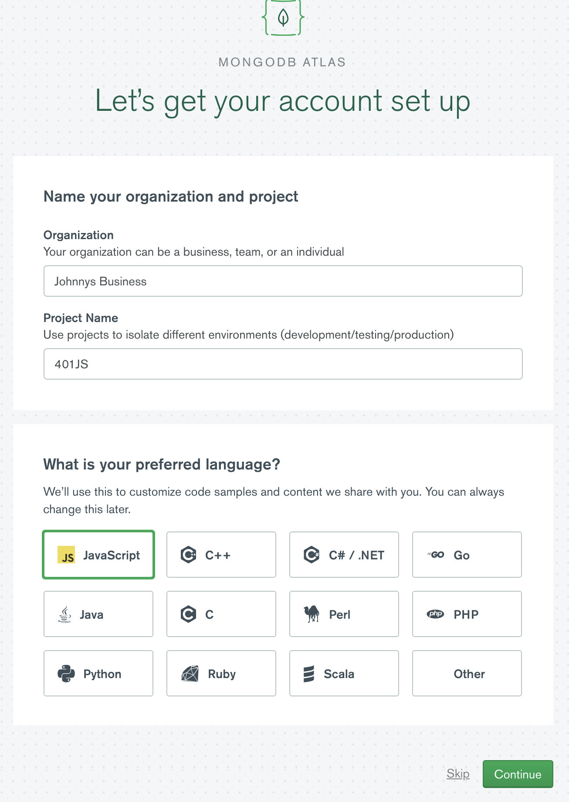
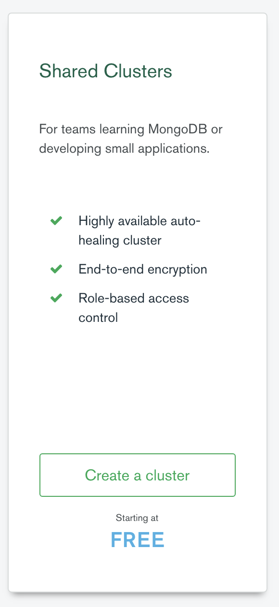
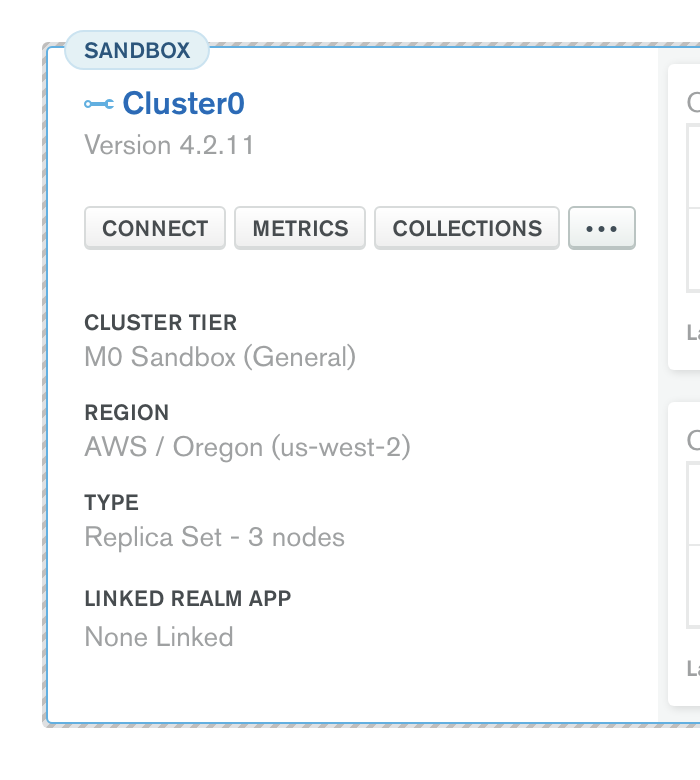
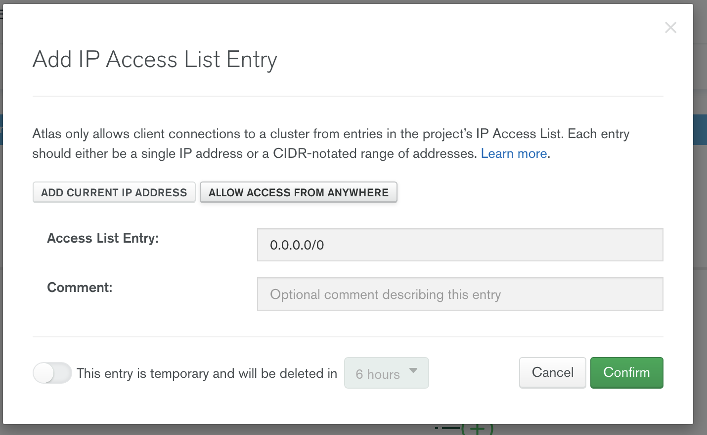
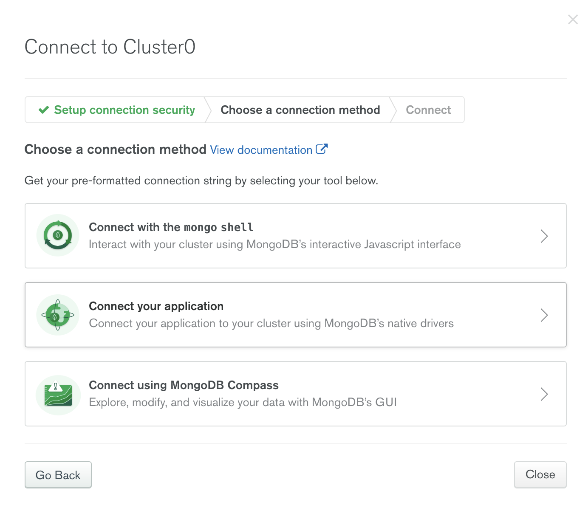

# Data Modeling

Data Modeling: The process of taking a real world or conceptual idea and encoding it into Javascript's built in data types. Models typically describe the physical characteristics (properties) and behaviors (methods) of an object in a way that you can write code that uses your models to problem solve and create applications.

## Learning Objectives

### Students will be able to

#### Describe and Define

- The role of data models
- CRUD Operations
- The "Repository" design pattern
- Interfaces and Services
- The differences between SQL and NoSQL Databases
- The MongoDB Ecosystem
- What is a Mongoose Schema
- CRUD Functionality through Mongoose Methods

#### Execute

- Model real world data
- Create models with constraints, type checking, validity using Mongoose
- Create an extensible CRUD interface and an implementation for a data model
- Proficiency with the `mongo` CLI and basic commands
- Testing code that relies on a Mongo Database server

## Today's Outline

1. Code Review
1. NoSQL databases and Mongo
1. Mongoose
1. Lab Demo
1. Deploying Mongo to Heroku

## Notes

### MongoDB Shell Commands

| Command                  | Description                                                                 |
| ------------------------ | --------------------------------------------------------------------------- |
| `mongo`                  | Launch the mongo shell. Once in the shell, you should see `>`               |
| `show dbs`               | Show all the databases                                                      |
| `use db <name>`          | Make/Use/View the database with name (no hyphens allowed; underscore only) `<name>`                                         |
| `show collections`       | Show all the collections in the current database                            |
| `db.<collection>.find()` | List all the documents / records in the specified collection `<collection>` |
| `db.<collection>.save()` | Save a new document / record to the specified collection `<collection>`     |
| `db.<collection>.drop()` | Completely removes the specified collection `<collection>`                  |

### A Mongoose "Schema" / "Model"

```javascript
const playersSchema = mongoose.Schema({
  name: { type: String, required: true },
  position: { type: String, required: true, uppercase: true, enum: ['P', 'C', '1B', '2B', '3B', 'SS', 'LF', 'RF', 'CF'] },
  throws: { type: String, required: true, uppercase: true, enum: ['R', 'L'] },
  bats: { type: String, required: true, uppercase: true, enum: ['R', 'L'] },
  team: { type: String, required: true },
});

const playersModel = mongoose.model('players', playersSchema)
```

### Mongoose Built-In CRUD Methods

Here are a few ways that Mongoose makes it easy to interact with your database
(All return promises)

```javascript
    let newRecord = new playersModel(record);
    return newRecord.save();

    playersModel.findOneByIdAndDelete(id);

    playersModel(findById(id));

```

### Hosted Mongo Databases: Atlas

While you can run Mongo on your own machines, it's quite common to run an instance of Mongo in the cloud so that you can take advantage of better hardware, more memory and higher speed networks. Mongo offers a hosted cloud database service called "Atlas" ... once you've got this setup, it's easy to connect your API servers from anywhere in the world to use it.

1. Sign Up
1. Setup the organization
   - Name your organization and project
   - These can be whatever you want to call them
   - Set Preferred Language (Javascript)
1. Pick the "Free" (Shared Cluster) option
1. Create Cluster
   - Choose AWS
   - Choose the closest region to your location (i.e. Oregon)
1. Create a DB User
   - Click the "Database Access" link
   - Add a new user
     - Choose Password Authentication
     - Choose a username and password
     - For access rights, choose "Atlas Admin"
1. Enable Network Access
   - Click Network Access Button
   - Click "Add IP Address"
   - Choose the "Allow Access from Anywhere" option
   - Click "Confirm"
1. Get your connection string
   - Click "Clusters" button on the left
   - Click on the "Connect" button on the cluster screen
   - To connect to your new database with the command line:
     - Choose the "Connect with Mongo Shell" option
     - Copy out the connection string
     - This will look something like this:
     - `mongo "mongodb+srv://cluster0.xtrut.mongodb.net/<dbname>" --username dba`
     - Replace `<dbname>` with the name of the database you want to use for your application, for example 'people'
   - To connect your Node or Express application:
     - Choose the "Connect your Application" option
     - This will look something like this:
     - `mongodb+srv://dba:<password>@cluster0.xtrut.mongodb.net/<dbname>?retryWrites=true&w=majority`
     - Replace `<password>` with the password you created earlier
     - Replace `<dbname>` with the name of the database you want to use for your application, for example 'people'
     - Use this as  `MONGODB_URI` in your .env file or at Heroku when you deploy












